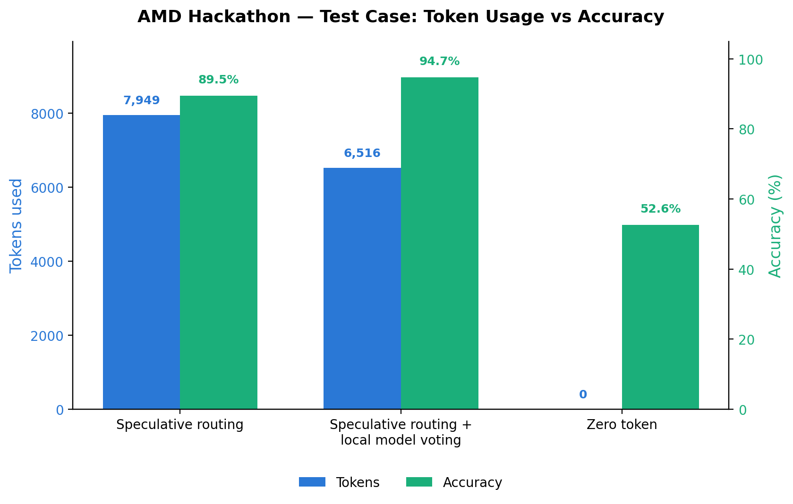

<p align="center">
  
</p>

<h1 align="center">Velora</h1>
<p align="center"><em>A zero-token, local-first agent for the AMD Developer Hackathon ACT II — Track 1: Hybrid Token-Efficient Routing Agent.</em></p>

<p align="center">
  <strong>0 remote tokens</strong> &middot; local Qwen2.5-3B + deterministic verification &middot; answers all 8 task categories inside the container
</p>

---

<p align="center">
  
</p>

## The Journey

We didn't start at zero tokens. We worked our way down to it — then, just for
fun, went all the way.

**Stage 1 — Speculative routing.** Our first submission was a speculative
local→remote escalation router: the local 3B model attempted every task, and
only the low-confidence ones escalated to Fireworks. It landed **89.5% accuracy
for 7,949 remote tokens** — solid accuracy, but heavy on the token score.

**Stage 2 — Local model voting + verification.** We then strengthened the local
tier so fewer tasks needed to escalate: multi-sample voting, executable
verification (math programs must agree, logic is brute-forced, code is compiled
and fuzz-checked), an offline facts gazetteer, and strict format enforcement.
Accuracy climbed to **94.7%** while tokens dropped to **6,516** — better on
both axes at once.

**Stage 3 — Zero tokens, just for fun.** Then we looked at the leaderboard and
spotted entries sitting at **0 tokens**. We wondered: could we do that too,
just for fun? We switched the remote escape hatch off and solved every task
entirely inside the container — the 3B model plus deterministic verification,
zero Fireworks calls. We hit **0 remote tokens** (the best possible token
score) at **52.6% accuracy**. Not the highest accuracy on the board — but the
boldest token score there is, and the run we're proudest of.

---

## How we optimize each mode

Velora ships two modes. Both share the same local-first engine; they differ in
whether the remote escape hatch is wired in.

| Mode | Image tag | Remote tokens | Accuracy | Role |
|------|-----------|--------------:|---------:|------|
| Zero-Token Local | `:zero` | **0** | 52.6% | The "just for fun" stretch — best token score |
| Hybrid Token-Efficient | `:latest` / `:hybrid` | ~6,516 | 94.7% | Max accuracy, token-disciplined escalation |

### Shared local engine (where the accuracy comes from)

The 3B model writes code; the interpreter guarantees correctness — accuracy
comes from **executing and cross-checking**, not from the model's mental
reasoning:

- **Math** — translate the word problem into Python, generate two independent
  programs, execute both, require identical answers (programs weight 2, CoT
  weight 1 in the vote).
- **Logic** — executable brute-force constraint search + truth-table
  decomposition, cross-checked against the model's chain-of-thought.
- **Code (gen + debug)** — generated/fixed code is compiled and run, then
  differential-fuzz-checked against an independent reference.
- **Facts** — offline capitals gazetteer (country → capital + nearby body of
  water) answers capital questions deterministically; other general knowledge
  uses two independent samples cross-checked for agreement.
- **Text (sentiment / NER / summarize)** — plain-text answers with format
  constraints enforced programmatically (NER `Entity - Type` one-per-line, JSON
  repackaged into the requested shape and casing, sentence/word/bullet counts
  trimmed to prompt limits).

Around the solvers:

- **2-pass pacing** — Pass 1 banks a best-shot answer for every task (cheap
  categories first); Pass 2 spends the remaining wall-clock re-verifying
  low-confidence tasks. A watchdog flushes and exits 0 at `HARD_DEADLINE`.
- **KV-cache reuse** (`--cache-reuse 256`) — the 2-pass design and voting
  ballots re-issue the same prompt repeatedly; repeats are near-instant, big
  savings under the 10-minute cap.
- **Context window** — `LLAMA_CTX=4096`, served by `llama-server` as a
  subprocess (not in-process), sized for long-passage summarisation/NER.

### Zero-Token Local Mode (`MODE=zero`)

Remote is never called — the Fireworks client isn't even imported. Every task
is solved inside the container, so the remote token score is exactly `0`. The
local engine carries accuracy where deterministic verification can reach (math,
logic, code, facts, format-strict text); general knowledge and hard
open-ended reasoning drop without the remote backstop — hence 52.6%. It is the
purest expression of the local-first strategy: best possible token score,
honest about the accuracy trade-off.

### Hybrid Token-Efficient Mode (`MODE=hybrid`)

Identical pipeline, but tasks whose answers could **not** be independently
verified locally escalate — one terse call each — to the cheapest suitable
model from `ALLOWED_MODELS` via `FIREWORKS_BASE_URL` (env-injected, never
hardcoded):

- **Confidence-based escalation** — only unverified tasks go remote (e.g. math
  programs disagree, code fails to compile).
- **Cheapest-model routing** — picks the cheapest suitable model per task
  (e.g. Minimax for reasoning, Kimi for code).
- **Strict token limits** — `reasoning_effort` disabled and `max_tokens` capped,
  so each escalation costs ~70–150 tokens.
- **Run-limit safeguard** — `ESC_MAX` (default 12) caps total escalations to
  prevent runaway token usage.

That discipline is what took Stage 2 to **94.7% / 6,516 tokens** — most tasks
solved and verified locally for free, only the genuinely hard ones spent a
little.

---

## How it works

```
/input/tasks.json
      │
      ▼
┌──────────────┐   regex, 0 cost
│  classifier   │──────────────► category (factual / math / sentiment /
└──────────────┘                summarize / NER / code-debug / code-gen / logic)
      │
      ▼
┌───────────────────────────────────────────────────────────┐
│ Pass 1 — bank a best-shot answer for every task           │
│   • math  : LLM writes a tiny Python program → executed   │
│             twice independently → results must agree      │
│   • code  : generated/fixed code is compiled AND run,     │
│             then differential-fuzz-checked vs a reference │
│   • logic : executable brute-force enumeration + truth-   │
│             table decomposition + cross-checked CoT       │
│   • facts : offline capitals gazetteer + 2 independent    │
│             answers cross-checked for agreement           │
│   • text  : sentiment/NER/summarize with format           │
│             constraints enforced programmatically         │
├───────────────────────────────────────────────────────────┤
│ Pass 2 — remaining time re-verifies low-confidence tasks  │
│   (MODE=hybrid only: escalate still-low-conf to Fireworks)│
├───────────────────────────────────────────────────────────┤
│ Watchdog — guarantees valid, complete results.json and    │
│            exit 0 well before the 10-minute limit         │
└───────────────────────────────────────────────────────────┘
      │
      ▼
/output/results.json
```

## Run it (Docker)

```bash
docker buildx build --platform linux/amd64 --tag velora-agent:zero --build-arg MODE=zero .
docker run --rm --cpus=2 --memory=4g \
  -v /path/to/input:/input:ro -v /path/to/output:/output \
  velora-agent:zero
```

`/path/to/input/tasks.json`:

```json
[ { "task_id": "t1", "prompt": "A store has 240 items. It sells 15% on Monday and 60 more on Tuesday. How many items remain?" } ]
```

## Container contract (Track 1)

- Reads `/input/tasks.json`, writes `/output/results.json`
  (`[{"task_id": ..., "answer": ...}]`), exits 0.
- `linux/amd64`, starts in seconds, finishes well inside the 10-minute cap; a
  watchdog flushes results and exits 0 even in worst-case stalls.
- Runtime env: `FIREWORKS_API_KEY`, `FIREWORKS_BASE_URL`, `ALLOWED_MODELS`
  (hybrid only; zero mode ignores them) plus `LLAMA_BIN`, `MODEL_PATH`,
  `LLAMA_THREADS`, `LLAMA_CTX`, `MODE`, `SOFT_DEADLINE`, `HARD_DEADLINE`.

## Repository layout

```
agent/            the agent (stdlib-only Python)
  main.py         orchestrator: 2-pass pacing, watchdog, atomic flushes
  classify.py     zero-cost category router
  solvers.py      per-category handlers + verification
  capitals.py     offline country → capital + body-of-water gazetteer
  local_llm.py    llama-server lifecycle + OpenAI-compatible client
  pyexec.py       sandboxed execution of model-written Python
  fireworks.py    hybrid-mode escalation (token-accounted; zero mode never imports it)
Dockerfile        3-stage build: llama.cpp release + GGUF weights + slim runtime
.github/          CI: build linux/amd64 + smoke test under judge limits
```

## Tech stack


Runtime is **stdlib only** (urllib, subprocess, ast, re, difflib, threading) —
no `llama-cpp-python`, `openai`, or `pydantic` in the image. The local model
(Qwen2.5-3B-Instruct Q4_K_M, ~1.9 GB) is served by `llama-server` with 2
threads, sized for the 4 GB / 2 vCPU judging environment. Remote is Fireworks
via `FIREWORKS_BASE_URL` (hybrid mode only). CI builds the `linux/amd64` image
on push to `main`, pushes `velora-agent:{zero,latest,hybrid,<sha>}` to GHCR,
then smoke-tests `:zero` under judge limits.

## Benchmarking

The repo keeps the benchmark category datasets (`benchmarks/datasets/`) and run
reports (`benchmarks/reports/`). The full how-to — running the local accuracy
simulator, pytest evals, the results dashboard, and dataset export for
fine-tuning — is in **[docs/benchmarks_guide.md](docs/benchmarks_guide.md)**
(legacy speculative-routing harness; see the note at the top of that guide).

---

<p align="center">
  
</p>
